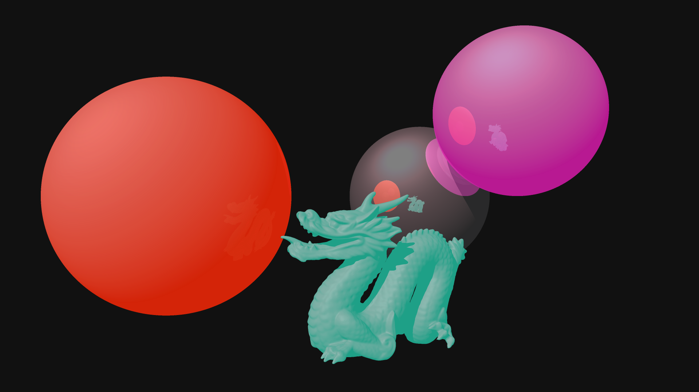

# raytracer (WIP)
### A simple raytracer written in Go

This is a simple raytracer, written from scratch with no external dependencies using the Go programming language. This is just a little hobby project of mine to learn Go and to deepen my knowledge about raytracing.

The raytracer is built mainly based on the contents of the summer semester 2022 edition of the  "Computergrafik" course by Prof. Dr. Frank Deinzer at the Technical University of Applied Sciences Würzburg-Schweinfurt. Some inputs were also taken from the "[Ray Tracing in One Weekend](https://raytracing.github.io/books/RayTracingInOneWeekend.html)" guide.

The raytracer works by reading a JSON config file that specifies camera positioning, lighting, and objects. It then proceeds to render a raytraced image based on this specification and outputs it as a PPM image file. The format of the JSON file is still a WIP. At this point, input and output files are still hard-coded, command line options will be added later on.

Features:
- [x] Basic ray tracing
- [x] Specular reflection
- [x] Basic support for wavefront (.obj) models (not all models are supported yet)
- [x] Bounding volume hierarchy for improved rendering times
- [x] Phong shading
- [ ] Full wavefront support
- [ ] Anti-Aliasing
- [ ] Diffuse lighting
- [ ] Refraction
- [ ] JPEG/PNG export
- [ ] Proper command line interface
- [ ] ...

Example rendering of an image with the current implementation (converted to PNG):
